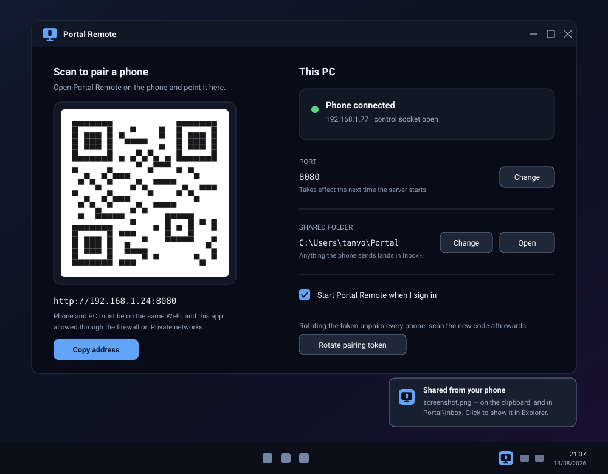
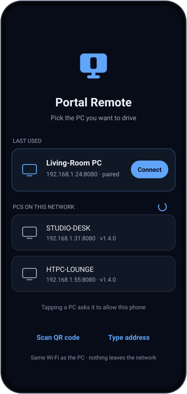
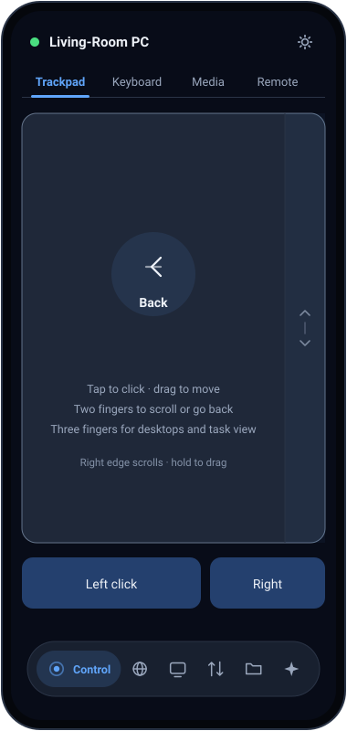
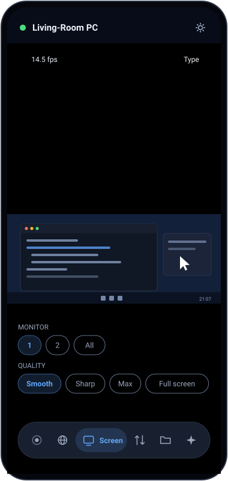
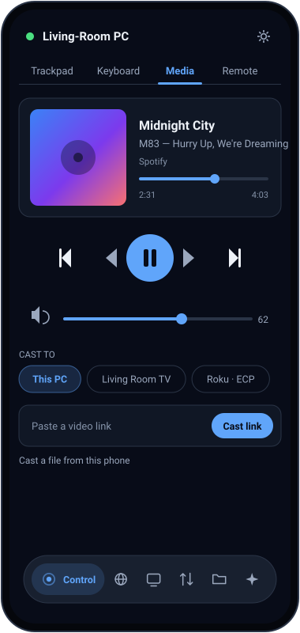
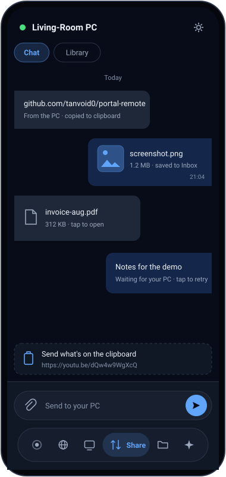

# Portal Remote

Control a Windows desktop from an Android phone over the local network — a Monect-style
remote: touch trackpad, keyboard, media keys, screen mirroring, casting and file
transfer. No cloud, no relay — the phone talks directly to a small server running on the
PC.

<p align="center">
  
</p>

<p align="center">
  
  
  
  
  
</p>

<p align="center"><sub>
Illustrative mockups of the real screens, drawn to the shared design system in
<a href="docs/design-system.md">docs/design-system.md</a>. Not captures of a running
build. Regenerate them with <code>python docs/assets/generate.py</code> — see
<a href="docs/development.md#screenshots">docs/development.md</a>.
</sub></p>

## What you can do with it

- **Drive the PC by hand** — a precision trackpad (multi-finger gestures, momentum,
  fine-control gain curve), a keyboard, media keys, and a TV-style D-pad remote for the
  couch.
- **See the screen** — live MJPEG mirroring at ~14.5fps, per-monitor, pinch to zoom to
  4×, tap to click where you looked.
- **Play and cast** — what the PC is playing shows up with cover art and a real scrubber;
  send a link or a local file to the PC, a Roku or a DLNA television.
- **Move things across** — the phone's system share sheet and the PC's `Ctrl+Alt+V` push
  links, images and files either way, onto the receiving device's clipboard before the
  notification lands.
- **Browse and transfer files** — list, download and upload against a shared folder on
  the PC.

## Try it

Every `v*` tag builds both halves and attaches them to a [GitHub
release](https://github.com/tanvoid0/portal-remote/releases): `PortalRemote.exe`
(self-contained, no .NET needed) and `PortalRemote-<version>.apk`.

1. Run `PortalRemote.exe` on the PC. It opens the window above and drops a tray icon.
2. Install the APK on a phone on the **same Wi-Fi** and open it.
3. Tap the PC in the discovered list and click Allow on the PC — or scan the QR code,
   which pairs without the prompt.

Both halves update themselves from those releases, and neither phones home otherwise —
the only request is to GitHub's public release API, when you ask.

Building from source instead: [docs/development.md](docs/development.md).

## Repo layout

```
android/   Kotlin + Jetpack Compose client
server/    .NET 8 / WinForms tray app + embedded Kestrel web server
docs/      design notes, status, security model, and the screenshot assets above
```

| Doc | What's in it |
|---|---|
| [docs/features.md](docs/features.md) | How each surface works and why it's shaped that way — mirroring, control, share, now playing, casting, pairing |
| [docs/status.md](docs/status.md) | Phase-by-phase status, what's next, and what still needs hardware to verify |
| [docs/security.md](docs/security.md) | The trust model — read this before pointing anything at it |
| [docs/development.md](docs/development.md) | Running, testing and packaging both halves from source |
| [docs/process.md](docs/process.md) | What live verification actually found, bug by bug |
| [docs/design-system.md](docs/design-system.md) | Shared tokens, motion spec and per-screen component guidance |
| [docs/phase4-casting.md](docs/phase4-casting.md) · [phase5-share.md](docs/phase5-share.md) · [phase7-assistant.md](docs/phase7-assistant.md) | Per-phase plans |

**Status in one line:** pairing, trackpad/keyboard/media, files and mirroring are done
and verified live; casting, quick share and the assistant are built but only partly
exercised against real hardware — see [docs/status.md](docs/status.md).

**Security in one line:** LAN-only, one shared bearer token, and holding that token is
the practical equivalent of sitting at the PC — see
[docs/security.md](docs/security.md).
