# Portal Remote

Control a Windows desktop from an Android phone over the local network — a Monect-style
remote: touch trackpad, keyboard, media keys, screen mirroring, casting and file
transfer. No cloud, no relay — the phone talks directly to a small server running on the
PC.

<p align="center">
  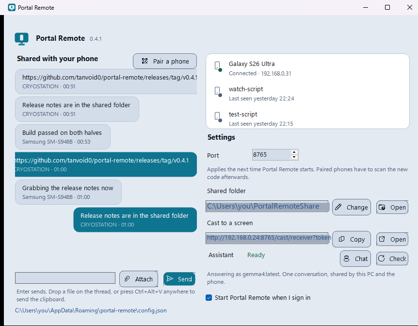
</p>

<p align="center"><b>Pairing and settings</b> — find the PC on the LAN, then tune how the trackpad feels</p>

<p align="center">
  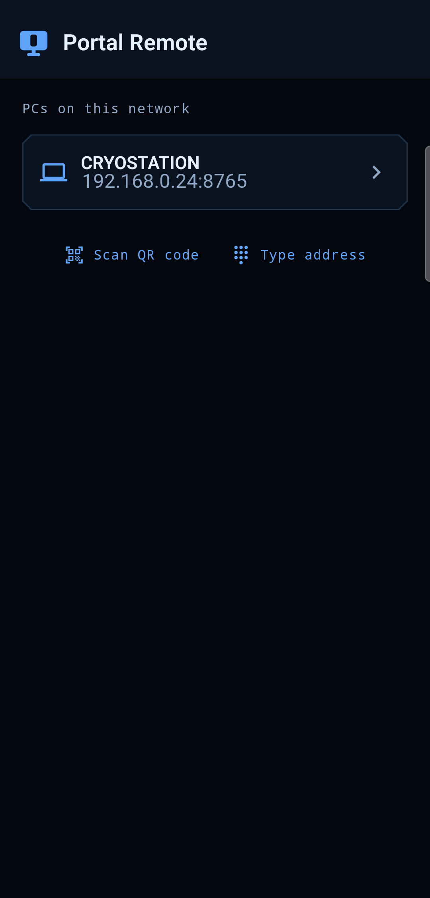
  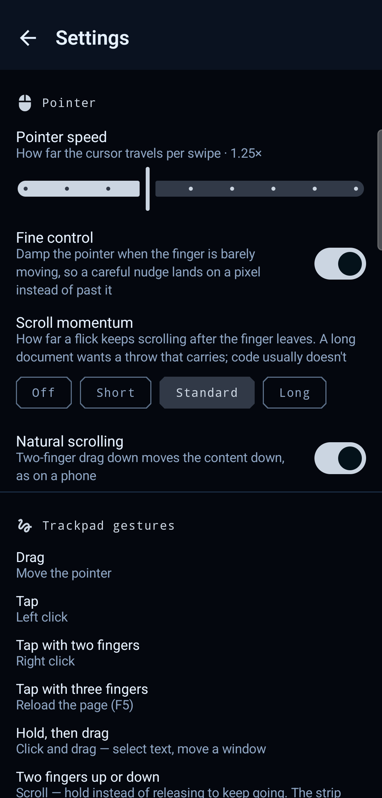
</p>

<p align="center"><b>Control</b> — the four ways to drive the PC by hand, behind one tab</p>

<p align="center">
  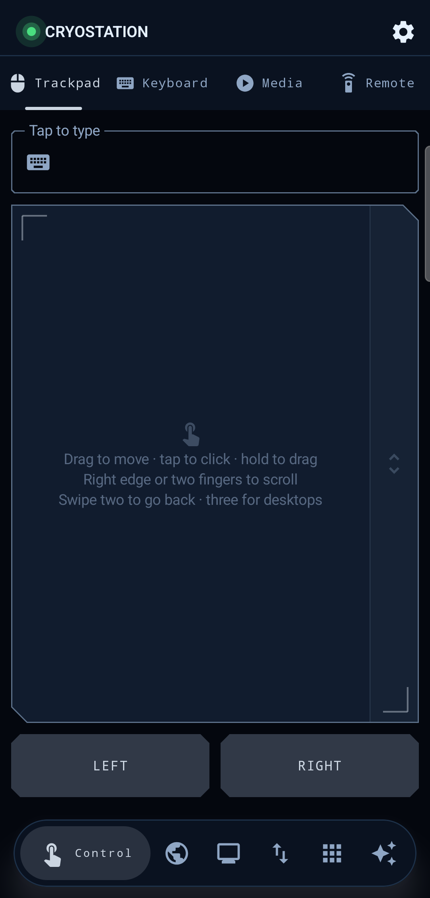
  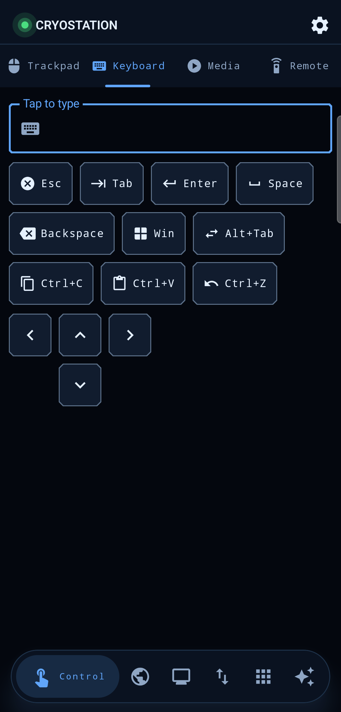
  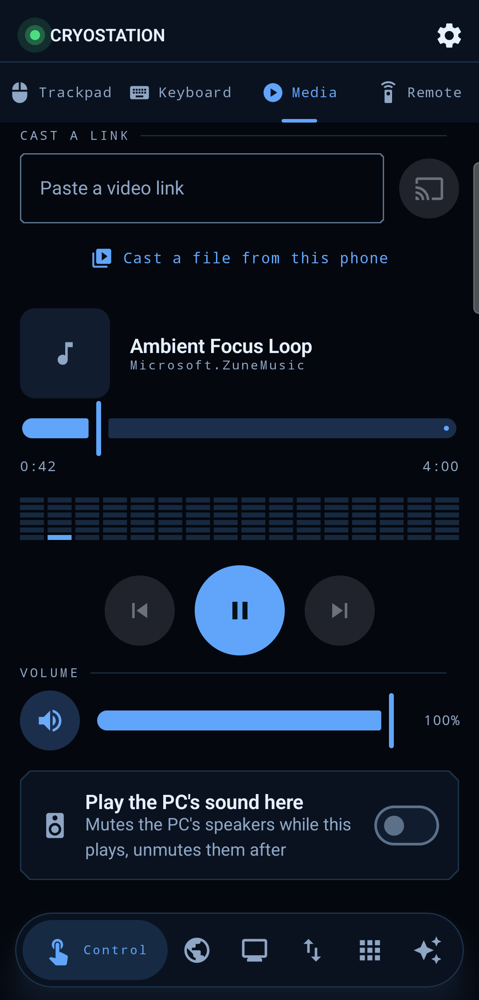
  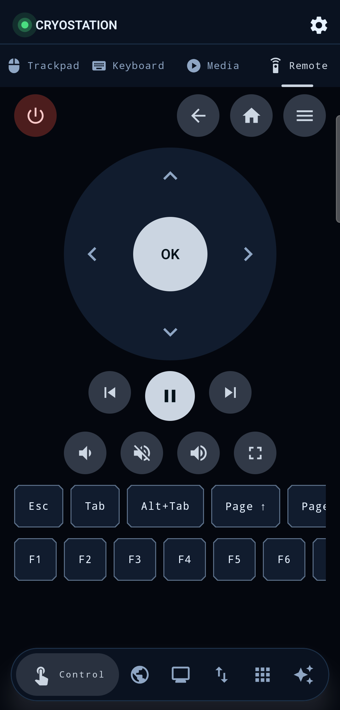
</p>

<p align="center"><b>Monitor</b> — the PC's desktop, and its vitals</p>

<p align="center">
  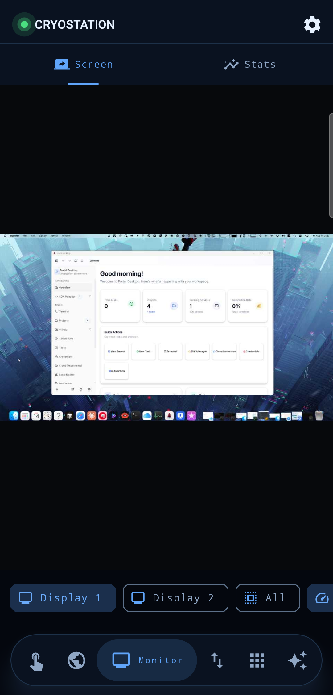
  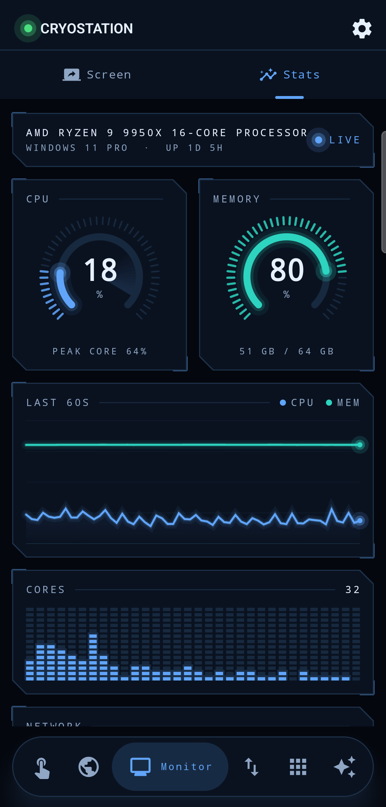
  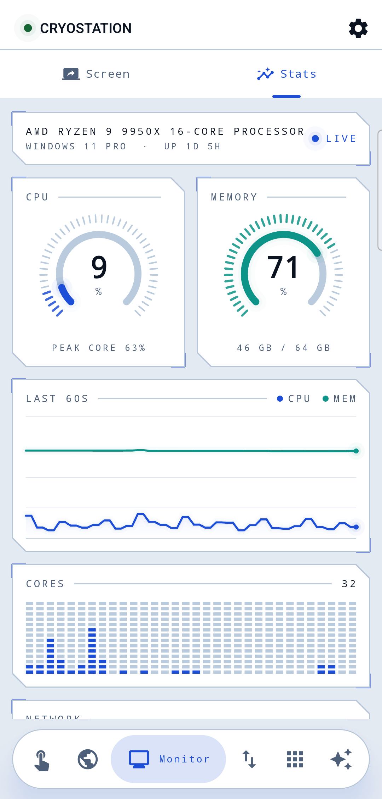
  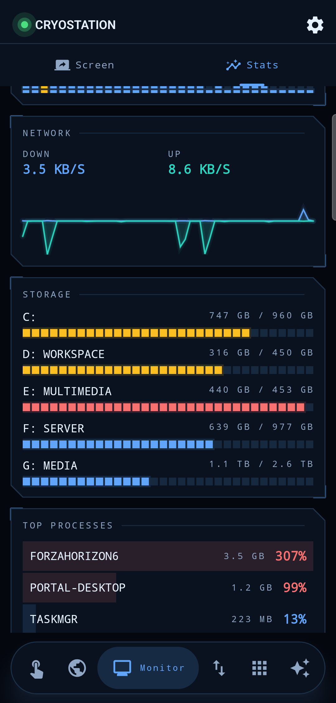
</p>

<p align="center">
  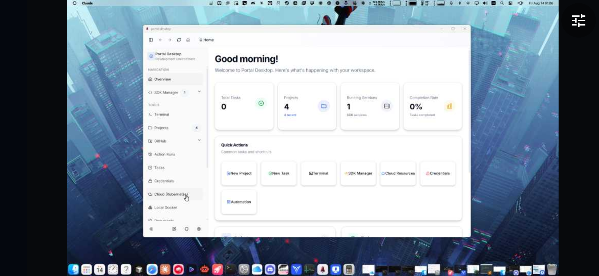
</p>

<p align="center"><b>Transfer</b> — push things across, or go and fetch them</p>

<p align="center">
  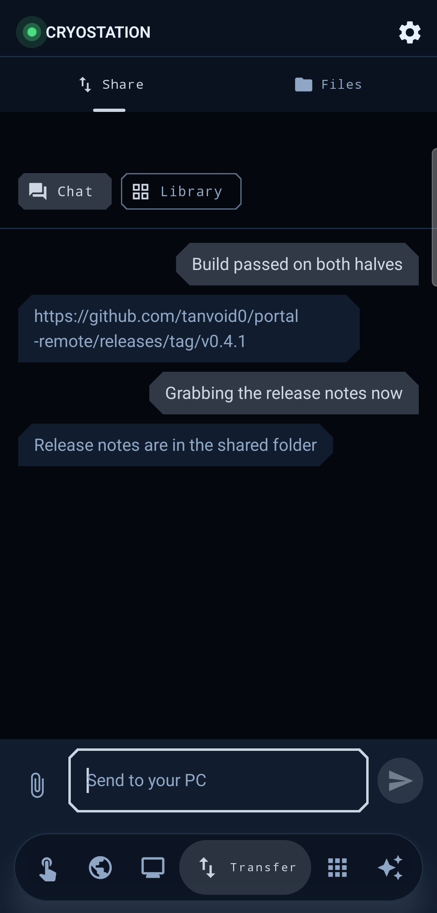
  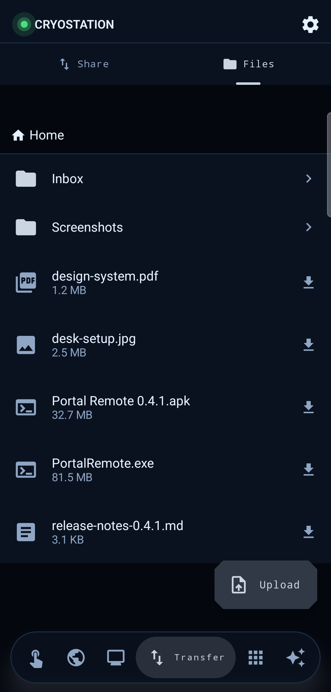
</p>

<p align="center"><b>Deck, Browser and Assistant</b></p>

<p align="center">
  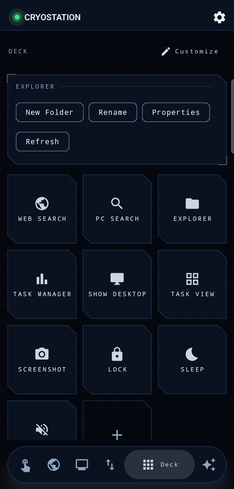
  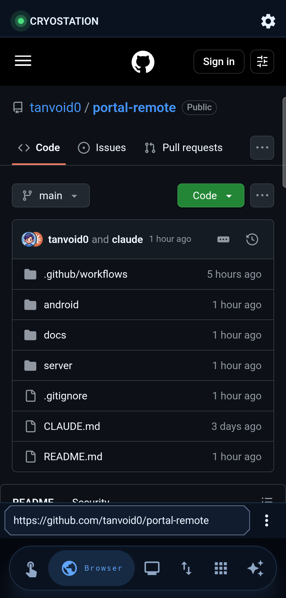
  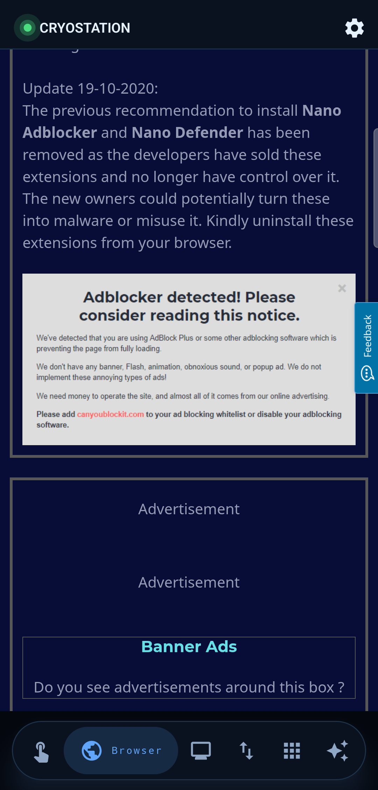
  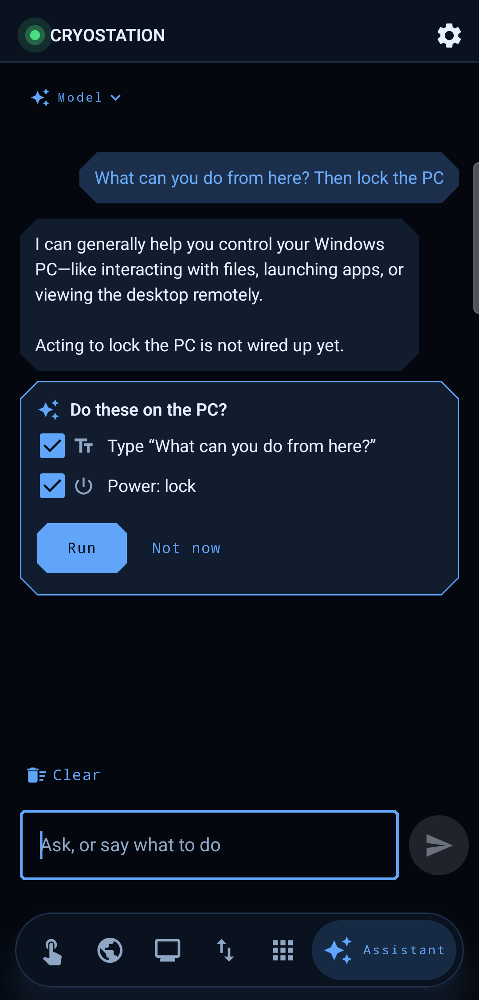
</p>

<p align="center"><sub>
Real captures of one running build — a paired phone over <code>adb</code>, and the tray
window straight off the PC. The phone's status bar is cropped so the set frames
identically; the shared folder, the share thread and the assistant conversation are
staged; and the LAN addresses, the Windows username and the phone's own name are
redrawn as neutral stand-ins. Nothing else is retouched. Re-shooting them is in
<a href="docs/development.md#screenshots">docs/development.md</a>.
</sub></p>

## What you can do with it

- **Drive the PC by hand** — a precision trackpad (multi-finger gestures, momentum,
  fine-control gain curve), a keyboard, media keys, and a TV-style D-pad remote for the
  couch.
- **See the screen** — live MJPEG mirroring at ~14.5fps, per-monitor, pinch to zoom to
  4×, tap to click where you looked.
- **Watch the machine** — a live resource dashboard drawn as an instrument panel: CPU
  per core, memory, a minute of history, network throughput, every drive, and what's
  using the most CPU right now. The PC only samples itself while that screen is open.
- **Play and cast** — what the PC is playing shows up with cover art and a real scrubber;
  send a link or a local file to the PC, a Roku or a DLNA television.
- **Browse the web** — an in-app browser that blocks ads, trackers and popups as you go,
  auto-declines cookie prompts from the major consent-banner vendors, and hands any video
  it finds straight to the cast button.
- **Move things across** — the phone's system share sheet and the PC's `Ctrl+Alt+V` push
  links, images and files either way, onto the receiving device's clipboard before the
  notification lands.
- **Browse and transfer files** — list, download and upload against a shared folder on
  the PC.
- **Make it yours** — light and dark are the same instrument under different lighting, and
  Settings → Colour swaps the accent between four pairs. Every one of them is checked
  against WCAG on both themes, so the picker can't produce a screen you can't read.
- **Ask the assistant** — one conversation shared by the phone and the PC, which can also
  act on the PC (media keys, shortcuts, typing, power) with every action approved
  separately. Needs [agent-platform](https://github.com/tanvoid0/agent-platform) — see
  below.

## Try it

Every `v*` tag builds both halves and attaches them to a [GitHub
release](https://github.com/tanvoid0/portal-remote/releases): `PortalRemote.exe`
(self-contained, no .NET needed) and `PortalRemote-<version>.apk`.

1. Run `PortalRemote.exe` on the PC. It opens the window above and drops a tray icon.
2. Install the APK on a phone on the **same Wi-Fi** and open it.
3. Tap the PC in the discovered list and click Allow on the PC — or scan the QR code,
   which pairs without the prompt.

Both halves update themselves from those releases, and neither phones home otherwise —
the only request is to GitHub's public release API, when you ask.

Building from source instead: [docs/development.md](docs/development.md).

## The assistant needs agent-platform

Everything above works on its own. The **assistant** is the one feature with an outside
dependency: it is backed by [**agent-platform**](https://github.com/tanvoid0/agent-platform)
— `agent-platformd`, a small Rust server that holds the model provider — and until that is
running on the PC, the assistant says *Not running* and does nothing else.

Portal Remote installs it for you. In the window, next to **Assistant**, press **Set up**:

1. It fetches the newest Windows server build from agent-platform's GitHub releases.
2. Unzips it into `%APPDATA%\portal-remote\agent-platform` — no installer, no elevation.
3. Starts it and waits for it to answer on `http://127.0.0.1:18410`.

That path is remembered, so afterwards the same button just says **Start**. Already
running your own `agent-platformd`? Point `AgentPlatform.BaseUrl` (and `ExePath`, if you
want the button to start yours) at it in `%APPDATA%\portal-remote\config.json` and Portal
Remote leaves it alone.

The phone never talks to agent-platform directly and never sees its token — the PC holds
it and reaches the daemon over loopback. What the model provider does with a conversation
is agent-platform's business, not this app's:
[docs/security.md](docs/security.md).

## Repo layout

```
android/   Kotlin + Jetpack Compose client
server/    .NET 8 / WinForms tray app + embedded Kestrel web server
docs/      design notes, status, security model, and the screenshot assets above
```

| Doc | What's in it |
|---|---|
| [docs/features.md](docs/features.md) | How each surface works and why it's shaped that way — mirroring, control, share, now playing, casting, pairing |
| [docs/status.md](docs/status.md) | Phase-by-phase status, what's next, and what still needs hardware to verify |
| [docs/security.md](docs/security.md) | The trust model — read this before pointing anything at it |
| [docs/development.md](docs/development.md) | Running, testing and packaging both halves from source |
| [docs/process.md](docs/process.md) | What live verification actually found, bug by bug |
| [docs/design-system.md](docs/design-system.md) | Shared tokens, motion spec and per-screen component guidance |
| [docs/phase4-casting.md](docs/phase4-casting.md) · [phase5-share.md](docs/phase5-share.md) · [phase7-assistant.md](docs/phase7-assistant.md) | Per-phase plans |

**Status in one line:** pairing, trackpad/keyboard/media, files and mirroring are done
and verified live; casting, quick share and the assistant are built but only partly
exercised against real hardware — see [docs/status.md](docs/status.md).

**Security in one line:** LAN-only, one shared bearer token, and holding that token is
the practical equivalent of sitting at the PC — see
[docs/security.md](docs/security.md).
